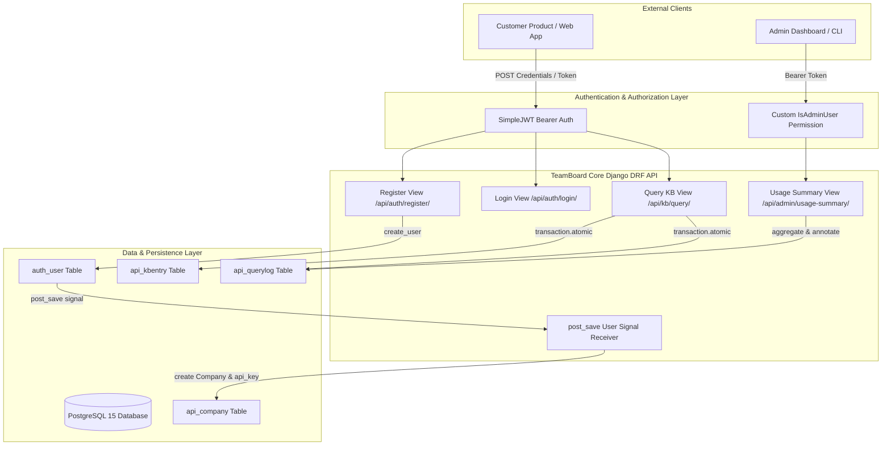
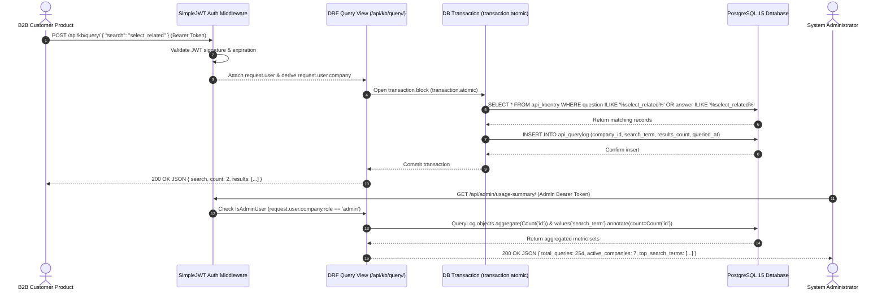

# 🎯 System Architecture & Design Guarantees

This document provides an in-depth architectural breakdown, security model analysis, database schema specification, and signal automation mechanics for **TeamBoard — B2B Knowledge Base API Platform**.

---

## 🏛️ System Architecture Overview

TeamBoard is engineered as a high-performance, multi-tenant B2B Knowledge Base platform built using **Django 5.0** and **Django REST Framework (DRF) 3.15**. It serves dual primary functions:

1. **Client Knowledge Base Serving & Usage Tracking**: B2B customer products send technical queries to TeamBoard on behalf of end-users. Queries are searched across curated technical Knowledge Base records (`KBEntry`) and logged atomically into `QueryLog` for consumption metering and usage-based billing.
2. **Platform Administration & Analytics**: System administrators access platform-wide aggregate statistics, company usage metrics, and top searched technical terms via a secure admin dashboard API.

---

## 🔄 Request Lifecycle & Sequence Diagram

The diagram below illustrates the exact request-response lifecycle for authenticated KB queries and admin analytics retrieval:

---

## 🛡️ Security Architecture & Business Guarantees

### 1. Server-Derived Identity vs. Client-Provided Tenant IDs
- **Vulnerability Avoided:** Many multi-tenant APIs require clients to send their `company_id` in the JSON request body or headers. This opens a security flaw where tenant A could query or spoof usage on behalf of tenant B.
- **TeamBoard Enforcement:** Identity is strictly established during JWT authentication. The view derives company scope server-side via `request.user.company`. Request body tenant identifiers are ignored.

### 2. Transactional Atomicity & Metered Usage Logging
- **Atomic Execution:** `query_kb_view` executes search query evaluation and `QueryLog` record creation inside a single `django.db.transaction.atomic()` block. If any step fails, both database operations rollback.
- **Zero-Result Logging Guarantee:** If a company queries for a keyword that matches 0 KB entries (`count = 0`), the query log entry is **still recorded**. This ensures that platform resource consumption and API call metering remain accurate for billing purposes regardless of query outcome.

### 3. Custom Role-Based Access Control (RBAC)
- **Class Definition:** Implemented in `api.permissions.IsAdminUser` extending `rest_framework.permissions.BasePermission`.
- **Role Isolation:** Rather than relying on Django's internal `is_staff` or `is_superuser` flags, `IsAdminUser` evaluates `request.user.company.role == Company.Role.ADMIN`.
- **Enforcement:** Non-admin client tokens attempting to access `/api/admin/usage-summary/` are rejected with `403 Forbidden`.

---

## 📊 Database Schema & Data Models Specification

### 1. `Company` Model (`api_company`)
Extends Django `User` via `OneToOneField` to represent a registered B2B customer.

| Field | Type | Attributes | Description |
|---|---|---|---|
| `id` | BigAutoField | Primary Key, Auto Increment | Internal unique ID |
| `user` | OneToOneField | `User`, `on_delete=CASCADE`, `related_name='company'` | Link to Django Auth User |
| `company_name` | CharField | `max_length=255` | Business name of the customer |
| `api_key` | CharField | `max_length=64`, `unique=True`, `blank=True` | Secure 32-char token |
| `role` | CharField | `max_length=10`, `choices=['admin', 'client']`, `default='client'` | Access control role |
| `created_at` | DateTimeField | `auto_now_add=True` | Registration timestamp |

### 2. `KBEntry` Model (`api_kbentry`)
Represents curated technical Knowledge Base questions and answers.

| Field | Type | Attributes | Description |
|---|---|---|---|
| `id` | BigAutoField | Primary Key, Auto Increment | Entry ID |
| `question` | TextField | Required | Technical question statement |
| `answer` | TextField | Required | Comprehensive technical explanation |
| `category` | CharField | `max_length=20`, `choices=['api', 'database', 'cloud', 'framework', 'general']` | Topic classification |
| `created_at` | DateTimeField | `auto_now_add=True` | Entry creation timestamp |

### 3. `QueryLog` Model (`api_querylog`)
Stores immutable usage records for platform analytics.

| Field | Type | Attributes | Description |
|---|---|---|---|
| `id` | BigAutoField | Primary Key, Auto Increment | Audit log ID |
| `company` | ForeignKey | `Company`, `on_delete=CASCADE`, `related_name='query_logs'` | Target company |
| `search_term` | CharField | `max_length=255` | Search term requested |
| `results_count` | IntegerField | Required | Number of matching KB records |
| `queried_at` | DateTimeField | `auto_now_add=True` | Timestamp of query execution |

---

## ⚡ Signal Automation Architecture

TeamBoard uses Django signals to guarantee automated profile initialization:

- **Signal Source:** `django.db.models.signals.post_save` on `django.contrib.auth.models.User`.
- **Receiver Function:** `api.signals.create_company_profile`.
- **Execution Condition:** Triggers when `created == True` or `instance._state.adding == True`.
- **Action:** Automatically generates a `Company` row associated with the new `User`, generating a cryptographically secure 32-character API key via Python's `secrets.token_urlsafe(32)`.
- **App Module Connection:** Connected inside `api.apps.ApiConfig.ready()`.

