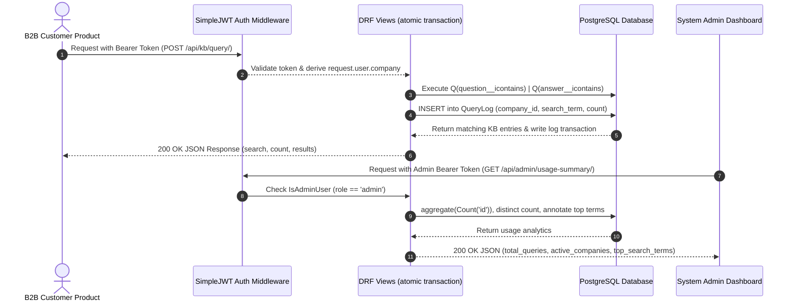

# 🎯 System Architecture & Design Guarantees

This document outlines the architecture, security mechanisms, data models, and request flow for **TeamBoard — B2B Knowledge Base API Platform**.

---

## 🏗️ Architecture Blueprint & Data Flow

TeamBoard acts as a centralized backend Knowledge Base for B2B client applications. Client products make API queries on behalf of their users, and TeamBoard logs each query atomically while returning matching Q&A results.

---

## 🛡️ Security & Business Logic Guarantees

### 1. Identity Verification vs. Client-Provided IDs
- B2B companies authenticate securely via SimpleJWT access tokens received during login.
- Company identity is **never** accepted from request bodies or parameters (which could be spoofed). Instead, identity is derived server-side via `request.user.company`.

### 2. Atomic Usage Logging & Zero-Result Tracking
- Search queries executed against `/api/kb/query/` search both `question` and `answer` fields using case-insensitive OR matching (`Q` objects with `icontains`).
- Search execution and `QueryLog` insertion are wrapped inside a `django.db.transaction.atomic()` block, ensuring that queries and audit logs commit or rollback together.
- Even if a search term returns 0 results, a `QueryLog` entry is recorded. This ensures platform usage billing counts actual query volume rather than matching items.

### 3. Role-Based Access Control (RBAC)
- Custom `IsAdminUser` permission class in [api/permissions.py](api/permissions.py) checks `request.user.company.role == Company.Role.ADMIN`.
- Does not rely on standard Django `is_staff` or `is_superuser` flags.
- Requests to `/api/admin/usage-summary/` with a standard `client` role receive `403 Forbidden`.

---

## 📊 Data Models Specification

Defined in [api/models.py](api/models.py):

### `Company`
Represents a B2B customer linked to Django's built-in `User` model via a `OneToOneField`.
- `user`: OneToOneField to `User` (`on_delete=CASCADE`, `related_name='company'`)
- `company_name`: CharField (max 255)
- `api_key`: CharField (max 64, unique, auto-generated via signal)
- `role`: CharField (`admin` or `client`, default `client`)
- `created_at`: DateTimeField (`auto_now_add=True`)

### `KBEntry`
Represents a curated Q&A record in the knowledge base.
- `question`: TextField
- `answer`: TextField
- `category`: CharField (`api`, `database`, `cloud`, `framework`, `general`)
- `created_at`: DateTimeField (`auto_now_add=True`)

### `QueryLog`
Tracks platform queries executed by client companies.
- `company`: ForeignKey to `Company` (`on_delete=CASCADE`, `related_name='query_logs'`)
- `search_term`: CharField (max 255)
- `results_count`: IntegerField
- `queried_at`: DateTimeField (`auto_now_add=True`)

---

## ⚡ Signal Automation Flow

Located in [api/signals.py](api/signals.py) and connected in [api/apps.py](api/apps.py):
- A `post_save` receiver on the `User` model detects when a user is created.
- Upon creation, a `Company` profile is automatically instantiated with an auto-generated 32-character API key (`secrets.token_urlsafe(32)`).
