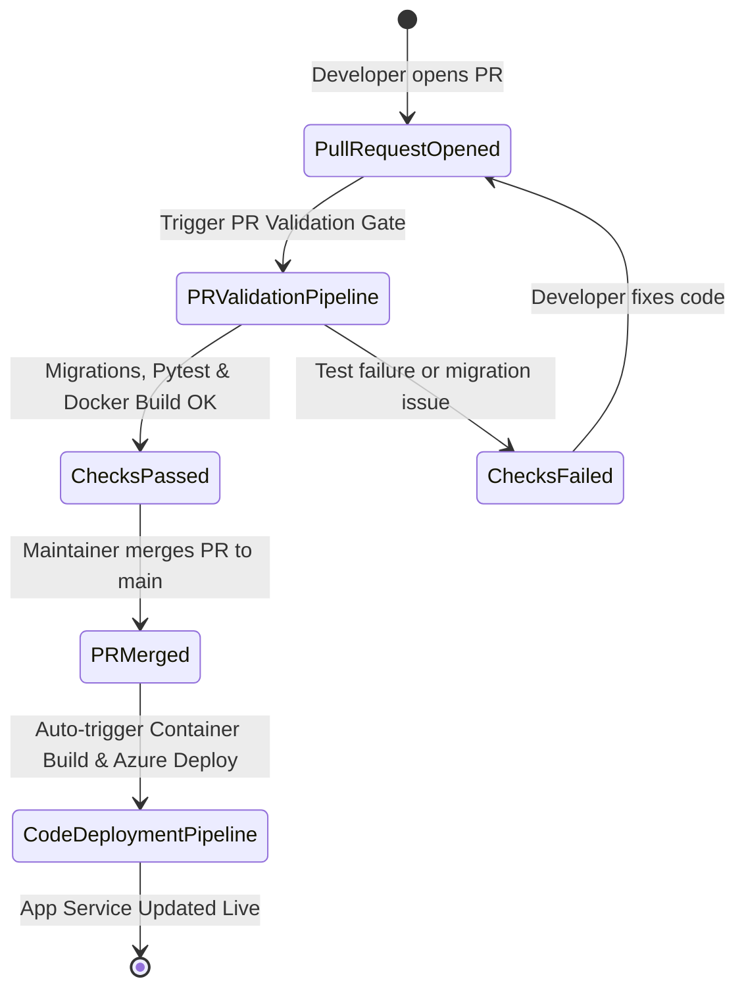

# 🔄 Templatized CI/CD Pipelines & PR Quality Gates

This document details the decoupled CI/CD pipelines, pre-merge PR quality gates, step templates, and automated workflows implemented for **TeamBoard**.

---

## 🎯 Decoupled Pipeline Strategy

To maintain separation of duties and prevent unnecessary pipeline runs, TeamBoard separates CI/CD tasks into four distinct pipelines:

| Pipeline Name | Purpose | Trigger Scope |
|---|---|---|
| **PR Validation Pipeline** | Pre-merge quality gate running migration checks, Pytest suite with coverage, and trial container build | Triggers on Pull Requests targeting `main`, `master`, or `develop` |
| **Code Testing Pipeline** | Standalone automated testing and quality checks | Triggers on commits to any branch |
| **Infrastructure Pipeline** | Provisioning and applying Terraform modules on Azure | Triggers on changes inside `infrastructure/` directory |
| **Code Deployment Pipeline** | Building production Docker image, pushing to ACR, and updating Azure App Service | Automated execution post-merge on `main` / `master` |

---

## 🔁 Automated Execution Lifecycle

---

## 🧱 Azure DevOps Templatisation (`pipelines/`)

Azure DevOps pipelines utilize reusable step templates defined in `pipelines/templates/`:

### 1. `pipelines/templates/test-steps-template.yml`
Configures Python 3.11, installs dependencies, verifies Django migrations (`makemigrations --check --dry-run`), executes `pytest` with JUnit XML output, and publishes code coverage results.

### 2. `pipelines/templates/terraform-steps-template.yml`
Navigates to `infrastructure/`, runs `terraform init`, and applies Terraform modules using Azure service credentials.

### 3. `pipelines/templates/docker-deploy-steps-template.yml`
Logs into Azure Container Registry, builds Docker container images tagged with `$(Build.BuildId)` and `latest`, pushes to ACR, and updates the target Azure Web App for Containers.

### Azure DevOps Pipeline Files
- [pipelines/pipeline-pr-validation.yml](pipelines/pipeline-pr-validation.yml) (PR Validation Gate)
- [pipelines/pipeline-code-testing.yml](pipelines/pipeline-code-testing.yml) (Automated Code Testing)
- [pipelines/pipeline-infra.yml](pipelines/pipeline-infra.yml) (Infrastructure Provisioning)
- [pipelines/pipeline-code.yml](pipelines/pipeline-code.yml) (Code Deployment)
- [azure-pipelines.yml](azure-pipelines.yml) (Master CI/CD Orchestrator)

---

## 🐙 GitHub Actions Workflows (`.github/workflows/`)

- `.github/workflows/pipeline-pr-validation.yml`: Runs on PRs to `main`/`master`/`develop`.
- `.github/workflows/pipeline-code-testing.yml`: Runs automated tests on push/PR across all branches.
- `.github/workflows/pipeline-infra.yml`: Runs Terraform init & apply when files in `infrastructure/` change.
- `.github/workflows/pipeline-code.yml`: Builds Docker container & deploys to Azure Web App automatically post-merge.
