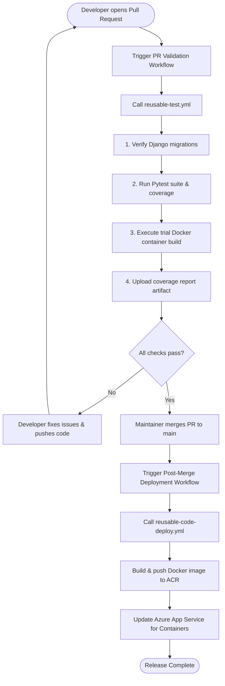

# 🔄 Templatized GitHub Actions CI/CD Pipelines & PR Quality Gates

This document provides a comprehensive specification for the decoupled GitHub Actions CI/CD pipelines, pre-merge Pull Request quality gates, reusable workflow templates, and deployment lifecycles for **TeamBoard**.

---

## 🎯 Decoupled Pipeline Architecture Strategy

TeamBoard separates CI/CD responsibilities into distinct, decoupled GitHub Actions workflows to enforce separation of concerns, optimize execution speeds, and prevent unnecessary pipeline triggers:

| Workflow File | Purpose | Trigger Strategy | Template Invoked |
|---|---|---|---|
| `.github/workflows/pipeline-pr-validation.yml` | **Pre-Merge PR Quality Gate**: Runs migration checks, Pytest suite, coverage reports, and trial Docker container build | Pull Request to `main`, `master`, `develop` | `reusable-test.yml` (`test-build-docker: true`) |
| `.github/workflows/pipeline-code-testing.yml` | **Automated Code Testing**: Verifies code changes and test suite status on any branch | Push to any branch, PR to `main`/`master` | `reusable-test.yml` (`test-build-docker: false`) |
| `.github/workflows/pipeline-infra.yml` | **Infrastructure Provisioning**: Executes Terraform init, plan, and apply to deploy/update Azure resources | Push to `main`/`master` (path: `infrastructure/**`) | `reusable-infra.yml` |
| `.github/workflows/pipeline-code.yml` | **Container Build & Deploy**: Builds production Docker container, pushes to ACR, updates Azure Web App | Push to `main`/`master` (post-PR merge) | `reusable-code-deploy.yml` |

---

## 🔁 Automated Execution & PR Validation Lifecycle

---

## 🐙 Reusable GitHub Actions Workflow Templates (`.github/workflows/reusable-*.yml`)

TeamBoard implements GitHub Actions Workflow Templatisation using `on: workflow_call:`. Caller workflows delegate step execution to modular, parametrized templates:

### 1. Reusable Testing Template (`.github/workflows/reusable-test.yml`)
Standardizes Python setup, dependency installation, migration integrity checks, test execution, coverage collection, and optional container build validation.

- **Inputs:**
  - `python-version` (default: `'3.11'`)
  - `test-build-docker` (boolean, default: `false`)
  - `artifact-name` (default: `'coverage-report'`)
- **Key Steps:**
  1. `actions/checkout@v4`
  2. `actions/setup-python@v5` with pip caching
  3. `python -m pip install -r requirements.txt`
  4. `USE_SQLITE=True python manage.py makemigrations --check --dry-run`
  5. `USE_SQLITE=True pytest --cov=api --cov-report=xml:coverage.xml --cov-report=term-missing`
  6. `docker build -t teamboard-test-build:latest .` (if `test-build-docker` is true)
  7. `actions/upload-artifact@v4` uploading `coverage.xml`

### 2. Reusable Infrastructure Template (`.github/workflows/reusable-infra.yml`)
Standardizes Azure CLI authentication, Terraform setup, provider initialization, and automated plan/apply execution.

- **Inputs:**
  - `terraform-version` (default: `'1.5.7'`)
  - `working-directory` (default: `'infrastructure'`)
- **Secrets:** `AZURE_CREDENTIALS`, `AZURE_CLIENT_ID`, `AZURE_CLIENT_SECRET`, `AZURE_SUBSCRIPTION_ID`, `AZURE_TENANT_ID`, `DB_ADMIN_PASSWORD`, `DJANGO_SECRET_KEY`
- **Key Steps:**
  1. `actions/checkout@v4`
  2. `azure/login@v1` with `AZURE_CREDENTIALS`
  3. `hashicorp/setup-terraform@v3`
  4. `terraform init`, `terraform plan`, `terraform apply -auto-approve` inside `working-directory`

### 3. Reusable Deployment Template (`.github/workflows/reusable-code-deploy.yml`)
Standardizes Azure Container Registry login, production Docker container building, tag management, ACR push, and Azure App Service release.

- **Inputs:**
  - `acr-name` (default: `'acrteamboarddev'`)
  - `webapp-name` (default: `'app-teamboard-dev'`)
  - `app-name` (default: `'teamboard'`)
- **Secrets:** `AZURE_CREDENTIALS`
- **Key Steps:**
  1. `actions/checkout@v4`
  2. `azure/login@v1` with `AZURE_CREDENTIALS`
  3. `az acr login --name ${{ inputs.acr-name }}`
  4. `docker build -t <acr>.azurecr.io/<app>:${{ github.sha }} -t <acr>.azurecr.io/<app>:latest .`
  5. `docker push` both image tags to ACR
  6. `azure/webapps-deploy@v2` targeting `<webapp-name>` with container image `<acr>.azurecr.io/<app>:latest`

---

## 🔑 Required Repository Secrets

Configure the following repository secrets under **GitHub Repository Settings -> Secrets and variables -> Actions**:

| Secret Name | Description |
|---|---|
| `AZURE_CREDENTIALS` | JSON Service Principal credentials generated via `az ad sp create-for-rbac` |
| `AZURE_CLIENT_ID` | Azure Service Principal App ID |
| `AZURE_CLIENT_SECRET` | Azure Service Principal Password/Key |
| `AZURE_SUBSCRIPTION_ID` | Target Azure Subscription GUID |
| `AZURE_TENANT_ID` | Azure Active Directory Tenant GUID |
| `DB_ADMIN_PASSWORD` | Secure administrator password for Azure PostgreSQL Flexible Server |
| `DJANGO_SECRET_KEY` | Cryptographic secret key for production Django instance |

