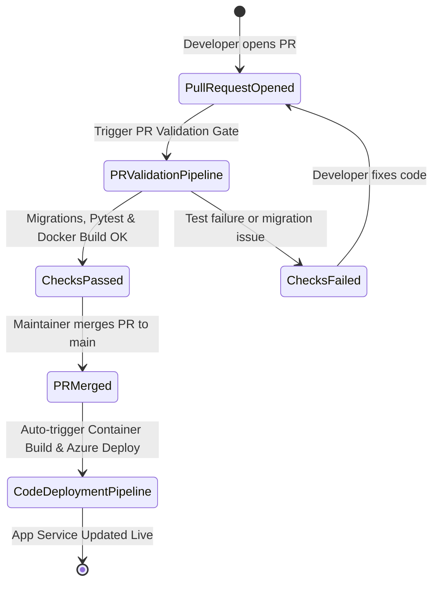

# 🔄 Templatized CI/CD Pipelines & PR Quality Gates

This document details the decoupled CI/CD pipelines, pre-merge PR quality gates, step templates, and automated workflows implemented for **TeamBoard**.

---

## 🎯 Decoupled Pipeline Strategy

To maintain separation of duties and prevent unnecessary pipeline runs, TeamBoard separates CI/CD tasks into four distinct pipelines:

| Pipeline Name | Purpose | Trigger Scope |
|---|---|---|
| **PR Validation Pipeline** | Pre-merge quality gate running migration checks, Pytest suite with coverage, and trial container build | Triggers on Pull Requests targeting `main`, `master`, or `develop` |
| **Code Testing Pipeline** | Standalone automated testing and quality checks | Triggers on commits to any branch |
| **Infrastructure Pipeline** | Provisioning and applying Terraform modules on Azure | Triggers on changes inside `infrastructure/` directory |
| **Code Deployment Pipeline** | Building production Docker image, pushing to ACR, and updating Azure App Service | Automated execution post-merge on `main` / `master` |

---

## 🔁 Automated Execution Lifecycle

---

## 🐙 GitHub Actions Templatisation (`.github/workflows/reusable-*.yml`)

GitHub Actions workflows are built on a modular template architecture using Reusable Workflows (`on: workflow_call:`). Every pipeline workflow in `.github/workflows/` delegates execution to a corresponding reusable template:

### Reusable Workflow Templates
1. **`reusable-test.yml`** (`.github/workflows/reusable-test.yml`):
   - Sets up Python with caching.
   - Installs dependencies from `requirements.txt`.
   - Runs Django migration integrity check (`makemigrations --check --dry-run`).
   - Executes Pytest suite with XML & term-missing coverage reports.
   - Conditionally executes trial Docker container builds (`test-build-docker: true`).
   - Uploads code coverage report artifacts.
2. **`reusable-infra.yml`** (`.github/workflows/reusable-infra.yml`):
   - Authenticates to Azure CLI using Azure credentials.
   - Initializes HashiCorp Terraform (`hashicorp/setup-terraform@v3`).
   - Executes `terraform init`, `terraform plan`, and `terraform apply -auto-approve` using environment secrets.
3. **`reusable-code-deploy.yml`** (`.github/workflows/reusable-code-deploy.yml`):
   - Authenticates to Azure Container Registry (`az acr login`).
   - Builds and tags production Docker images with `${{ github.sha }}` and `latest`.
   - Pushes image to ACR and deploys container to Azure Web App for Containers (`azure/webapps-deploy@v2`).

### Active GitHub Actions Pipelines (Invoking Templates)
- `.github/workflows/pipeline-pr-validation.yml`: Invokes `reusable-test.yml` with `test-build-docker: true`.
- `.github/workflows/pipeline-code-testing.yml`: Invokes `reusable-test.yml` with `test-build-docker: false`.
- `.github/workflows/pipeline-infra.yml`: Invokes `reusable-infra.yml` passing Azure secrets and workspace settings.
- `.github/workflows/pipeline-code.yml`: Invokes `reusable-code-deploy.yml` passing ACR & Web App inputs.
